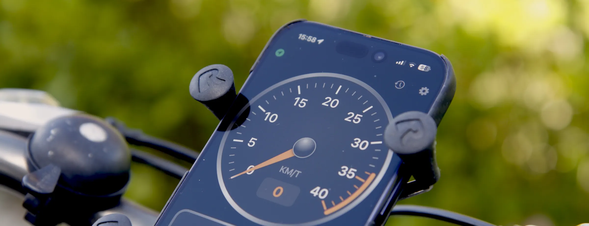

# BikeSpeed

A fullscreen iPhone speedometer for your bike, styled after 80s-car analog dashboards. Mount your phone on the handlebar, open the app, and ride — no setup, no accounts, no distractions.

## Features

- **Analog speed gauge** — a live GPS-driven needle on a 270° dial, with a configurable max speed and a red danger zone near the top, plus a digital speed readout in the center
- **Trip stats** — average speed, max speed, distance, duration, altitude, climb, and GPS position, all updating live in a 2×2 panel; tap or swipe a cell to page through its readouts (speed cell: average ↔ max; distance cell: distance ↔ duration; altitude cell: altitude ↔ climb ↔ position)
- **Auto-pause** — distance and time pause automatically when you stop and resume the moment you move off, so your average speed doesn't sag at every red light; on by default, and switchable in Settings
- **Elevation & gradient** — total climb over the ride and a live gradient percentage, measured by the barometer for accuracy where available and by GPS otherwise
- **Direction of travel** — an arrow plus compass letters (N, NE, E, SE, S, SW, W, NW) showing which way you're heading, with the name of the street you're currently on below it; the arrow stays live at a standstill by switching to the compass when GPS course goes quiet
- **Route map & GPX export** — every ride records its track; open a saved trip to see it drawn on a map, tap the map to explore it full-screen with pan and zoom, and export it as a GPX file to share with Strava, Komoot, or any other app
- **GPS signal indicator** — a top-left glyph tinted green/yellow/red for signal quality; when the signal is too poor to trust, speed and distance freeze rather than drift on noise
- **Trip controls** — Start, Pause/Resume, Save, and Reset, so you can pause a ride, save a finished one to your trip log, and reset cleanly for a new one
- **Background recording** — a trip keeps recording when the screen locks or you switch apps, so you can pocket the phone mid-ride without losing the trip
- **Trip log** — completed trips are saved with date, duration, distance, average/max speed, total ascent/descent, a route map, and height-profile and speed-profile charts plotted against distance; up top, switch between your lifetime totals and personal bests (longest ride, fastest average, top speed, biggest climb) with a tap or swipe
- **Built for hundreds of rides** — trips are grouped into month sections, newest first, with a date-range filter (All, Last 7 days, Last 30 days, This year) and a jump-to-top button once you've scrolled down; swipe a row to delete a ride you don't want to keep
- **iCloud sync** — your trip log syncs automatically to your private iCloud database, so your rides, routes, and personal bests follow you across your own iPhones with nothing to set up
- **Settings** — set your own max gauge speed, switch between metric (km/h) and imperial (mph) units, toggle auto-pause, and override the app's display language independent of your device setting
- **Built for the handlebar** — runs fullscreen with the home indicator hidden, and keeps the screen from sleeping while you ride
- **English and Norwegian** — follows your iPhone's language setting automatically, or pick one explicitly in Settings

## Getting started

1. Mount your iPhone on your handlebar with a case/mount that keeps the screen visible and portrait-oriented.
2. Open BikeSpeed and allow location access when prompted — this is required for the speedometer, GPS position, and direction indicator to work. Allow Motion & Fitness too if you want barometer-accurate climb figures; without it, climb still works from GPS.
3. Tap the gear in the control pill at the top-right to set your preferred max gauge speed, units (metric/imperial), auto-pause, and display language before you start riding.
4. Tap **Start** to begin tracking a trip. Average speed, distance, and climb begin accumulating from this point, and recording continues even if the screen locks.
5. Stop at a light and the trip pauses itself (auto-pause), resuming when you ride on, so your average speed stays accurate — no stats are reset. You can also tap **Pause** to stop manually, and **Resume** to continue.
6. When you're done, tap **Pause/Stop** and then **Save** to add the trip to your trip log (open it via the list icon in the same pill), or **Reset** to discard it and start fresh. Reset is only available once the trip is manually paused, so you can't accidentally lose an in-progress ride.

## Running your own copy

BikeSpeed is open source, and everything but one thing builds and runs as-is. That one thing is the CloudKit container the trip log syncs to — it's tied to an Apple developer team, so it can't be shared. To run your own copy with iCloud sync:

1. In Xcode, open the **BikeSpeed** target ▸ **Signing & Capabilities** and set **Team** to your own (or edit `DEVELOPMENT_TEAM` in `project.pbxproj`).
2. Change the bundle id from `lekanger.BikeSpeed` to your own (`PRODUCT_BUNDLE_IDENTIFIER`). **That's the only identifier you need to change** — the CloudKit container is `iCloud.<your bundle id>` everywhere: `BikeSpeed.entitlements` uses `iCloud.$(PRODUCT_BUNDLE_IDENTIFIER)` and the app derives the same string at runtime from its bundle id, so nothing is hardcoded to mine.
3. The project already declares the **iCloud (CloudKit)** and **Push Notifications** capabilities. With automatic signing, building to a device once creates the `iCloud.<your bundle id>` container on your account.
4. Before distributing (TestFlight/App Store), open the [CloudKit Dashboard](https://icloud.developer.apple.com/) and **deploy the schema to Production** — record types are auto-created in Development at runtime but must be promoted by hand for release builds.

If you'd rather not use iCloud at all, set `cloudKitDatabase: .none` in `TripModelContainer.app()` (`BikeSpeed/Models/BikeSpeedSchema.swift`) and remove the iCloud capability — trips then stay on-device, exactly as they did before sync was added.

## Requirements

- iPhone running iOS 18.0 or later
- Location Services enabled for BikeSpeed (When In Use is sufficient; recording continues in the background while a trip is running)
- Optional: Motion & Fitness access, for barometer-based climb and gradient — without it, climb falls back to GPS altitude
- A GPS signal — speed, direction, and position accuracy depend on GPS reception, so results may be less accurate indoors or in dense urban areas

## Privacy

BikeSpeed has no accounts, no analytics, and no tracking, and it does not collect your data or share it with anyone. Your location is used only to drive what you see on screen. Your trips are stored in the app's own storage on your device and synced to your **private iCloud database** — the same iCloud account you're already signed into, readable only by you and never by us or anyone else — so your trip log follows you across your own devices. If you're not signed into iCloud, everything simply stays on the device. Either way, deleting the app removes its on-device storage.

The one thing that leaves your phone on its own is a reverse-geocoding lookup: to show the name of the street you're on, BikeSpeed asks Apple's mapping service what street a coordinate corresponds to, using Apple's built-in MapKit/Core Location APIs. That lookup sends the coordinate to Apple, subject to [Apple's privacy policy](https://www.apple.com/legal/privacy/), and happens only occasionally as you move between streets, not continuously. Beyond that and the private-iCloud trip sync described above, nothing — speed, distance, altitude — is sent off the device automatically, and nothing at all is ever shared with us or any third party. If you have no network connection, the street name is simply left blank and the rest of the app works as usual.

The one exception is entirely your choice: when you tap **Export GPX** on a saved trip, BikeSpeed hands that ride's track to the share sheet so you can send it to another app or service. That only ever happens when you ask for it, with the trip you picked, going where you send it.
